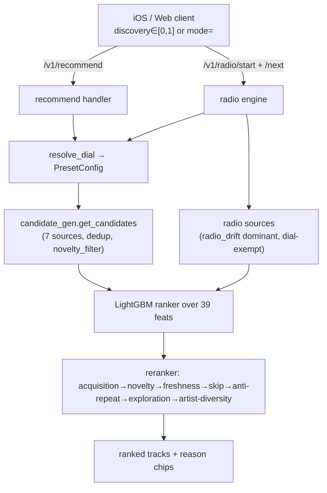

# GrooveIQ Recommendation Algorithm — End‑to‑End Audit & Tuning Guide

**Date:** 2026-06-11
**Scope:** Full trace of the recommendation pipeline from the iOS Ampster app → GrooveIQ API → candidate generation → scoring → reranking → radio, verified against the live prod DB (read‑only) and the live API (`grooveiq.devii.ch`).
**Purpose:** A reference document for making targeted improvements with Claude Code. It (a) sketches the whole algorithm front‑to‑back, (b) root‑causes the three reported concerns with code + live evidence, (c) lists other latent issues found, (d) benchmarks against Spotify/YT‑Music/academic practice, and (e) gives a prioritized fix/tuning plan.

> Verification method: 6 code‑mapping passes (iOS + web frontends, candidate gen, scoring/taste, reranker/modes/radio core, config) + 2 live passes (prod DB forensics on the primary user's real data + live API A/B tests) + 3 adversarial verifications. All file:line references checked against the working tree. Sensitive identifiers (API key, DB password, host, raw user id) are intentionally omitted here.

---

## 0. TL;DR — the three concerns

| # | Concern | Verdict | One‑line root cause |
|---|---------|---------|---------------------|
| 1 | "Adventurousness slider does next to nothing; Familiar radio still returns non‑familiar tracks" | **Confirmed bug (design/source‑mapping gap)** | The slider value reaches radio correctly, but radio is ~100% driven by `radio_drift` (acoustic neighbours of the seed), which the dial **deliberately never re‑weights** — and the `familiar` preset has **no positive "prefer my proven tracks" term anywhere**. It only declines to *exclude* novelty; it never *promotes* familiarity. |
| 2 | "Discover Mixes contain tracks I've already liked" | **Confirmed bug (wrong criterion)** | The novelty filter that should keep known tracks out gates on the confidence model's *"proven"* test (`mu/sigma`), **never on the explicit like/play signal**. Liked‑but‑thinly‑played tracks fail the proven test and survive; CF is also called with `filter_already_liked_items=False`. |
| 3 | "Radio feels repetitive fast; should I add a repeat penalty or boost skip weight?" | **Confirmed tuning gap (both levers genuinely absent)** | There is **no play/serve‑frequency repeat penalty** anywhere; the only repeat control is a binary time‑window exclude that the `familiar` preset **disables** (`repeat_window_hours=0`). Skips are the *gentlest*‑weighted signal in radio. Both proposed levers are well‑targeted and additive. |

Live numbers backing these up (primary user, real data):
- **Familiar radio (discovery=0.0)** surfaced **0 of the user's 27 liked tracks** and **0 tracks with play_count ≥ 2** — but `GET /v1/recommend?mode=familiar` returned 15/15 genuine favourites (avg ~10 plays). *Same dial, opposite outcomes.*
- **`mode=discovery`** returned **6/25 explicitly liked** tracks, **24/25 already‑played**, only ~1–2 genuinely new. All leaks came via `source=cf`.
- **Radio repeat rate = 53.7%** (3123 impressions over 1446 distinct tracks); one track served **22×**; back‑to‑back repeats observed (0.0‑min gap).

---

## 1. End‑to‑end pipeline map

### 1.1 Frontends and the API contract

Two clients speak the same backend contract. There is **no separate "custom mix" endpoint** — every shelf is `GET /v1/recommend/{user}` with different fixed params; radio is its own stateful service.

**iOS Ampster** (`Sources/Shared/Services/`):
- One HTTP client `GrooveIQClient` ([Constants.swift:61‑122](Constants.swift) defines endpoints).
- **Radio:** `POST /v1/radio/start` → `GET /v1/radio/{id}/next?count=&discovery=` → `DELETE /v1/radio/{id}`.
- **All mixes / recs:** `GET /v1/recommend/{uid}?mode=&discovery=&limit=&…context`.
- The **"Adventurousness" slider** (Settings) writes one value, `UserDefaultsManager.discoveryBaseline ∈ [0,1]` (default 0.3). **It drives RADIO only** ([RecommendationRouter.swift:483](RecommendationRouter.swift) start, :555/:579 next). The named mixes are **hardcoded tiers**, not the slider:
  - Library "Recommended Mix" → `mode=familiar` ([RecommendationRouter+Modes.swift:163](RecommendationRouter+Modes.swift))
  - Discover Mix → `mode=discovery` (:169)
  - Weekly Discovery → `mode=deep_discovery` (:175)
  - Track of the Day → `mode=discovery` (:182)
- Param rule ([GrooveIQClient.swift:222‑228](GrooveIQClient.swift)): if `mode` set → send `mode`, drop `discovery`; else if `discovery` set → send it; else send neither (→ server default `balanced`). **Verified live:** iOS sends `discovery=0.0` verbatim; the server echoes it. *Concern #1 is not a transmission bug.*

**Web dashboard** (`app/static/js/v2/explore.js`) uses the identical contract; its dial anchor stops (Familiar 0.0 / Balanced 0.3 / Discover 0.6 / Deep 1.0) must mirror `modes_cfg.dial_anchors`.

### 1.2 The discovery dial → presets (`app/services/modes.py`)

`resolve_dial(discovery, mode, modes_cfg)` maps the request onto one of four **admin‑tuned `PresetConfig` anchors**, interpolating linearly between anchors for intermediate dial values ([modes.py:104‑149](app/services/modes.py)). Precedence: explicit `mode` > `discovery` float > `default_preset` (`balanced`). The resolved preset becomes a **whitelisted, request‑scoped override** ([modes.py:47‑50](app/services/modes.py)) — it can only touch `modes.active` + `reranker.{exploration_fraction, freshness_boost, repeat_window_hours}` (security‑by‑construction; the dial can never reach ranker hyperparams).

### 1.3 Two candidate paths

GrooveIQ assembles candidates **independently** for the two surfaces:

**(A) Global `/v1/recommend`** (`app/services/candidate_gen.py:get_candidates`) — powers all iOS shelves incl. Discover Mixes. Sources, each × a `candidate_sources` weight:

| source | weight | what |
|---|---|---|
| content / content_profile | 1.0 | FAISS acoustic sim to seed / taste centroid |
| cf | 1.0 | implicit‑ALS collaborative filtering — **`filter_already_liked_items=False`** ([collab_filter.py:244](app/services/collab_filter.py)) |
| session_skipgram | 0.8 | Word2Vec session co‑occurrence |
| lastfm_similar | 0.7 | cached Last.fm `track.getSimilar` |
| sasrec | 0.6 | transformer next‑track |
| popular | 0.3 | 30‑day play sums |
| artist_recall | 0.2 | tracks near recently‑played |

Merged first‑occurrence‑wins → deduped → dial's `source_weight_mult` + `novelty_filter` applied → sorted → truncated. (`session_gru.py` and `music_map.py` are **not** wired into candidate gen — GRU is a ranker feature only; music_map writes dashboard UMAP coords.)

**(B) Radio `/v1/radio`** (`app/services/radio.py:get_next_tracks`) — a separate, stateful, in‑memory engine. Sources:

| source | weight | what |
|---|---|---|
| **radio_drift** | **1.2 (highest)** | FAISS NN to a feedback‑adapted drift embedding — **exempt from the dial** |
| radio_seed | 1.0 | FAISS NN to fixed seed embedding |
| radio_content | 0.9 | direct seed‑track FAISS NN |
| radio_skipgram | 0.7 | session co‑occurrence |
| radio_lastfm | 0.6 | Last.fm similar |
| radio_cf | 0.4 | collaborative filtering |
| radio_artist | 0.8 | same‑artist (artist seeds) |

The **drift embedding starts equal to the seed** ([radio.py:303‑304](app/services/radio.py)) and only moves on in‑session like/skip feedback. So radio is fundamentally **seed‑acoustic anchored**, regardless of dial.

### 1.4 Scoring — there are TWO "scores" (do not conflate)

1. **Offline `satisfaction_score`** (`app/services/track_scoring.py`) — a per‑(user,track) engagement *label* materialised from listen events: `full_listen·1.0 + skip_penalty(context) + mid·0.2 + like·2.0 + dislike·−2.0 + repeat·1.5 + playlist_add·1.5 + queue_add·0.5 + heavy_seek·−0.3`, then per‑user min‑max normalised to [0,1]. **Not used to rank directly** — it is (a) the LightGBM training label, and (b) one feature.
2. **Online candidate score = LightGBM ranker** (`app/services/ranker.py`, model trained, ~780 samples) over a **39‑dim feature vector** (`feature_eng.py`). `satisfaction_score` is by far the dominant feature (importance 721; next recency 248, taste_drift 212, sequential 208). With no model it **falls back to the `satisfaction_score` feature directly** — which is 0 for unplayed tracks, so radio's blend (below) matters.

"Similarity to taste" is a *learned* function of ~12 delta/affinity features (`|track_feat − profile_mean|` for bpm/energy/dance/valence, multi‑timescale deltas, mood_match, popularity_pref, SASRec/GRU drift) — **not a single cosine**.

Radio blends `ranker_score·0.6 + retrieval_score·0.4` ([radio.py:598](app/services/radio.py)) so FAISS similarity still orders the list when the ranker is weak.

### 1.5 Confidence / "proven" model (`app/services/confidence.py`)

Computes per‑track `mu` (predicted engagement) and `sigma` (uncertainty, `≈1/(1+0.5·evidence)`). **`is_proven = mu ≥ proven_mu_min AND sigma ≤ proven_sigma_max`** ([confidence.py:283](app/services/confidence.py)). Deliberately **decoupled from the explicit like flag** — a never‑heard track in a loved cluster can be "proven"; a liked‑but‑thin track is **not**. This decoupling is the engine of concern #2.

### 1.6 Reranker rules (`app/services/reranker.py`), in order

1. **Dial acquisition** (gated `kappa>0 OR lambda_proven>0`): `score += kappa·sigma − lambda_proven·[is_proven]`. *Only a demotion of proven tracks; there is no proven **boost**.*
2. **Dial novelty penalty** (gated `novelty_weight>0`): `score −= novelty_weight·min(1, plays/8)` — smooth familiarity demotion.
3. **Freshness boost:** `score ×= (1+freshness_boost)` for **never‑interacted** tracks only.
4. **Skip suppression:** if `early_skip_count > skip_threshold(2)` AND played within 24h → `score ×= skip_demote_factor(0.5)`.
5. **Anti‑repetition:** **hard exclude** tracks played within `repeat_window_hours` (binary, time‑based).
6. **Exploration slots:** reserve `max(1, int(n·exploration_fraction))` bottom‑half tracks with Thompson‑style noise.
7. **Artist diversity:** ≤ `artist_max_per_top(2)` per artist in top `artist_diversity_top_n(10)`.

### 1.7 Config system (`app/models/algorithm_config_schema.py`, `app/services/algorithm_config.py`, `request_config.py`)

8 Pydantic groups; a **process‑wide singleton** loaded from the DB (`algorithm_configs` table), with the per‑request dial override layered on via `contextvars`. **No per‑user config** — everything is global config + per‑request dial.



---

## 2. The discovery dial: schema defaults vs LIVE prod (config v4)

The active prod config is **v4 ("Adopt modes config group")**. It matches schema defaults **except** the discovery/deep presets have *weakened* novelty, and `novelty_weight` is **0 for every preset** (the field post‑dates v4 and loads as 0).

| knob | familiar (0.0) | balanced (0.3) | discovery (0.6) | deep_discovery (1.0) |
|---|---|---|---|---|
| kappa (UCB) | 0 | 0 | 0.35 *(live ~0.3)* | 0.6 |
| lambda_proven (proven demote) | 0 | 0 | 0.5 **(live 0.3)** | 0.6 |
| exploration_fraction | **0.0** | 0.15 | 0.30 | 0.50 |
| freshness_boost | **0.0** | 0.10 | 0.20 | 0.30 |
| novelty_filter | off | off | **on** | **on** |
| novelty_strength | 0 | 0 | 0.75 **(live 0.5)** | 1.0 |
| novelty_weight | 0 | 0 | 0.25 **(live 0.0)** | 0.5 **(live 0.0)** |
| repeat_window_hours | **0.0** | 2.0 | 2.0 | 2.0 |
| source_weight_mult | content_profile×1.5, cf×1.4, artist_recall×1.3, lastfm×0.6, sasrec×0.7, popular×0.5 | none (no‑op) | tilt → lastfm/sasrec/content | tilt → lastfm/sasrec/content |

**Reading this table for the concerns:**
- `familiar` zeroes **every** active lever and adds **no** proven‑boost → it is almost a no‑op except a source tilt that (for radio) never reaches the dominant source.
- `familiar.repeat_window_hours = 0` → **choosing Familiar turns OFF anti‑repetition** (concerns #1 and #3 are coupled).
- Live `novelty_weight = 0` everywhere → the one smooth "sink known tracks" lever is **fully off in prod** (hurts #2 and removes a ready #3 lever).
- Live `discovery.novelty_strength = 0.5` (not 0.75) → proven sigma‑bar = `0.3·0.5 = 0.15` (needs ~11 evidence units) → **narrower** exclusion → **more** likes leak at `discovery` than at `deep_discovery`.

---

## 3. Concern deep‑dives

### Concern #1 — Adventurousness / "Familiar" radio does nothing useful

**Symptom:** Familiar radio still serves unfamiliar tracks; the dial seems inert.

**Root cause (two compounding defects):**
1. **The dominant radio source is dial‑exempt.** Radio is ~83–100% `radio_drift` (FAISS neighbours of the seed/drift embedding). `_RADIO_SOURCE_DIAL_KEY` ([radio.py:58‑65](app/services/radio.py)) **deliberately omits `radio_drift`**, so the familiar source tilt (content_profile×1.5, cf×1.4, artist_recall×1.3) never multiplies the bulk of the pool ([radio.py:558‑562](app/services/radio.py)).
2. **No positive familiarity force exists.** The `familiar` preset sets `kappa=0, lambda_proven=0, novelty_filter=False, novelty_weight=0, freshness_boost=0`. The reranker acquisition block is gated off ([reranker.py:121](app/services/reranker.py)), and the only dial terms that *do* exist push **away** from familiar (proven demotion, novelty penalty/filter, freshness boost). **There is no mirror term that up‑ranks the user's proven/known tracks.** "Familiar" merely *declines to exclude novelty* — it never *prefers* familiarity.
3. (Minor) `_dial_drift_scale` (familiar 0.7×) only scales *feedback‑driven* drift; on a cold/first batch with no feedback it's inert ([radio.py:74‑82,387‑395](app/services/radio.py)). And `max(1, int(n·exploration_fraction))` ([reranker.py:333](app/services/reranker.py)) forces ≥1 exploration track even when `exploration_fraction=0`.

**Live evidence:** discovery 0.0 vs 1.0 on the *same seed* both returned ~100% `radio_drift`; the 15 Familiar tracks included **0** with play_count ≥ 2 and **0** of the user's 27 liked tracks. By contrast `GET /v1/recommend?mode=familiar` returned 15/15 user‑played favourites (avg ~10 plays). **The dial machinery is sound; radio routes around it.**

**Fix:** see §6 items **F1‑a / F1‑b** (server‑side in `radio.py` + a new familiar boost term; client is correct).

### Concern #2 — Liked tracks leak into Discover Mixes

**Symptom:** `mode=discovery` mixes contain tracks the user explicitly liked; "some mixes look correct" (it's per‑track dependent).

**Root cause:** The *only* mechanism that removes known tracks at the discovery posture is `apply_novelty_filter` ([candidate_gen.py:413‑414](app/services/candidate_gen.py)):
```
exclude tid  iff  mu ≥ proven_mu_min(0.6)  AND  sigma ≤ proven_sigma_max·novelty_strength
```
**`like_count` and `play_count` are never criteria.** A single like ≈ 1 evidence unit → `sigma ≈ 1/(1+0.5·1) = 0.67`, far above the live bar of 0.15, so it survives. 21/27 of the user's likes also fail the `mu ≥ 0.6` gate outright. Compounded by: CF re‑injects liked items (`filter_already_liked_items=False`, [collab_filter.py:244](app/services/collab_filter.py)); `novelty_weight=0` in prod (the smooth demotion never fires); freshness boost only touches *never‑played* tracks. The base exclusion set ([candidate_gen.py:91‑102](app/services/candidate_gen.py)) removes **disliked / heavily‑skipped** tracks but has **no symmetric like‑based exclusion**.

**Live evidence:** `mode=discovery` → 6/25 explicitly liked, 24/25 already‑played, ~1 new; 18 of 27 liked tracks leaked across 71% of discovery requests in the audit history; even the #1 favourite (31 plays, mu 0.891) leaked 26×. `mode=deep_discovery` was clean (novelty_strength=1.0 widens the bar to 0.30). **UX bug:** leaked CF tracks carry the misleading reason chip **`exploring`** (acquisition ran, not `is_proven`).

**Fix:** see §6 item **F2** — add an explicit like/play exclusion to the discovery+ candidate path. This deterministically closes it; tuning `novelty_strength`/`novelty_weight` only reduces it probabilistically.

### Concern #3 — Radio repetition (repeat penalty vs skip weight)

**Symptom:** radio (esp. at Familiar) repeats quickly despite low skip rate.

**State of the code today:**
- Within‑session de‑dup is solid (`exclude = played_set | disliked`, [radio.py:445](app/services/radio.py)) — but **sessions are ephemeral in‑memory**, so a fresh session off the same seed re‑serves the same FAISS cluster (two Familiar runs were 100% identical).
- The only repeat control is the **binary** anti‑repetition window ([reranker.py:211‑225](app/services/reranker.py)) — and **`familiar` sets `repeat_window_hours=0`, disabling it.**
- **No play/serve‑frequency penalty exists** (the user's "de‑rank repeatedly‑played" idea). `novelty_weight` could serve this but is 0 everywhere and is meant for discovery.
- Skips are the **gentlest** signal in radio: `w_early_skip_radio=−0.25` (vs −0.5/−0.75 elsewhere), in‑session `feedback_skip_weight=0.5` halved again ([radio.py:395](app/services/radio.py)). Skip‑suppression rarely fires (`early_skip>2` AND within 24h).
- `w_repeat=+1.5` **rewards** replays in the training label — pointing the *opposite* way.
- `_enforce_no_consecutive_artist` is a **dead stub** ([radio.py:775‑788](app/services/radio.py)) — `return ranked` unchanged; artist clustering (Audiomachine 108, Alan Walker 85 impressions) goes unchecked in radio.

**Live evidence:** repeat rate **53.7%** (3123/1446); max 22×; 146 tracks served 5+×; back‑to‑back (0.0‑min) repeats; 7/21 repeats inside 2h that `repeat_window_hours=2` would have caught but Familiar disables. Near‑duplicate distinct track_ids (two "Hans Zimmer – Oil Rig") that id‑dedup can't catch.

**Verdict on the two levers:** both are genuinely absent and well‑targeted. **Prioritize the repeat penalty** (recency‑decayed cooldown, floored so favourites cool down rather than get banned — matches radio's familiarity intent). Skip‑weight is secondary and should be done by making the reranker skip de‑rank *graded* for radio, **not** by blanket‑raising `w_early_skip_radio` (which corrupts the global satisfaction label). See §6 items **F3‑a / F3‑b**.

---

## 4. Other findings & latent bugs (keep an eye open)

| Sev | Finding | Location |
|---|---|---|
| Med | **Exploration floor defeats zero‑exploration.** `max(1, int(n·exploration_fraction))` injects ≥1 bottom‑half track even when a preset sets `exploration_fraction=0` (familiar). | [reranker.py:333](app/services/reranker.py) |
| Med | **`_enforce_no_consecutive_artist` is a no‑op stub.** Radio relies entirely on the global reranker for artist diversity. | [radio.py:775‑788](app/services/radio.py) |
| Med | **Live config drift from schema.** v4 has `novelty_weight=0` for all presets and weaker discovery novelty (`strength 0.5`, `lambda 0.3`). Restoring schema values is part of the #2/#3 fix. | `algorithm_configs` v4 |
| Low | **Misleading reason chip.** Leaked liked tracks show `exploring`. | [modes.py:267‑276](app/services/modes.py) |
| Low | **Telemetry gap.** Audit `request_context` never stores the resolved `discovery`/`mode`, so dial posture can't be reconstructed from the DB — it must be inferred from reranker‑action signatures. Add it to make future tuning measurable. | `recommendation_request_audits` |
| **Sec** | **API bearer key stored verbatim** as `created_by` on `algorithm_configs` rows v2–v4 — a live credential sitting in a queryable column. Should be a user id, not the raw token. | `algorithm_configs.created_by` |
| Low | **Near‑duplicate track_ids** (same artist+title, different id) bypass id‑based de‑dup and add to perceived repetition. | radio de‑dup / library |

---

## 5. How Spotify / YouTube Music / academia do it (benchmarks)

Exact production weights are proprietary; the *design patterns* are well documented and GrooveIQ already mirrors most of them — the gaps are in calibration, not concept.

- **Exploration vs exploitation (the "adventurousness" dial).** Spotify's home is driven by **BaRT** ("Bandits for Recommendations as Treatments") — a multi‑armed/contextual bandit that trades **exploit** (highest predicted engagement from history) against **explore** (high‑uncertainty items to gather information). Uncertainty *drives* exploration. GrooveIQ's `+kappa·sigma` acquisition term is exactly this UCB shape — but it only has the explore side; **there is no symmetric "exploit my proven favourites" boost at the familiar end**, which is the concern‑#1 gap. ([Explore, Exploit, Explain — Spotify Research](https://research.atspotify.com/publications/explore-exploit-explain-personalizing-explainable-recommendations-with-bandits); [Calibrated recommendations with contextual bandits, 2025](https://research.atspotify.com/2025/9/calibrated-recommendations-with-contextual-bandits-on-spotify-homepage); [BaRT overview](https://dynamoi.com/learn/faqs/what-is-spotify-bart-algorithm))
- **Familiar vs novel = different surfaces (not one dial on one engine).** Discover Weekly **optimizes for novelty + likelihood of liking** (mostly unheard); **Daily Mix** clusters your taste and serves **mostly known + a few new per cluster**; **radio/autoplay** leans familiar. This validates GrooveIQ's product split (familiar mix vs discover mix) — the bug is that "familiar" isn't implemented as a familiarity‑*preferring* ranker. ([Discover Weekly explainer](https://playlisteer.com/blog/exploring-the-algorithm-how-spotify-curates-your-discover-weekly-playlist); [QZ: the magic of Discover Weekly](https://qz.com/571007/the-magic-that-makes-spotifys-discover-weekly-playlists-so-damn-good))
- **Skip modeling.** Spotify's WSDM‑2019 challenge treats skips as a **graded** signal — `skip_1 / skip_2 / skip_3 / not_skipped` — over 130M sessions, modeled sequentially (RNNs). Takeaway for concern #3‑b: prefer a **graded** radio skip de‑rank over a single flat `early_skip` weight. ([Spotify Sequential Skip Prediction Challenge](https://www.aicrowd.com/challenges/spotify-sequential-skip-prediction-challenge); [RNN session skip prediction](https://arxiv.org/pdf/1904.10273))
- **Repeat consumption / fatigue (concern #3).** Academic consensus: **recency of consumption is the strongest predictor of repeat**, items **devalue with repeated exposure** (boredom), and **inter‑arrival gaps grow** before abandonment. The right shape is a **time‑decayed recency/cooldown penalty**, not a permanent ban — exactly the floored, decaying penalty recommended below. Repeat‑aware session models (RepeatNet) and replay‑aware recommenders (Deezer) formalize this. ([Modeling repeat consumption / boredom, WWW'16](https://cseweb.ucsd.edu/classes/fa17/cse291-b/reading/sequences-www2016.pdf); [Discovery Dynamics: repeated exposure](https://arxiv.org/pdf/2210.16226); [RepeatNet](https://arxiv.org/pdf/1812.02646); [Considering Durations and Replays — Deezer](https://arxiv.org/pdf/1711.05237))

---

## 6. Prioritized fix & tuning plan

Two buckets: **config‑only** (no deploy, change `algorithm_configs`) and **code** changes. All fixes are server‑side; the iOS client is correct.

### Quick wins — config only (do first, measure)

| id | Change | Where | Suggested value | Addresses |
|---|---|---|---|---|
| C1 | Restore `novelty_weight` | modes.discovery / deep | 0.25 / 0.5 | #2, #3 |
| C2 | Restore `discovery.novelty_strength` | modes.discovery | 0.5 → 0.75 (bar 0.15→0.225) | #2 |
| C3 | Restore `discovery.lambda_proven` | modes.discovery | 0.3 → 0.5 | #2 |
| C4 | Stop disabling anti‑repeat at Familiar | modes.familiar.repeat_window_hours | 0.0 → ~1.0–2.0 | #3 |
| C5 | Add a small familiar/balanced repeat demotion | modes.{familiar,balanced}.novelty_weight | 0.10–0.15 | #3 |

> Note: C2/C3/C5 only reduce leaks *probabilistically*; the deterministic fix for #2 is F2.

### Code changes (ordered by leverage)

**F2 — Close the Discover leak deterministically (highest‑value correctness fix).**
In `apply_novelty_filter` ([candidate_gen.py:413](app/services/candidate_gen.py)), for `novelty_filter` presets, union an **explicit known set** into `to_exclude`: `track_ids WHERE like_count > 0 OR play_count >= N` (N≈3–5), subject to the existing starvation floor ([candidate_gen.py:426‑430](app/services/candidate_gen.py)). Also set `filter_already_liked_items=True` for discovery/deep in `collab_filter.recommend` ([collab_filter.py:244](app/services/collab_filter.py)). Because radio reuses this same filter ([radio.py:563‑564](app/services/radio.py)), one change fixes both paths.

**F1‑a — Add a positive familiarity boost (mirror of the novelty penalty).**
Add `familiarity_weight` to `PresetConfig`; in the reranker, near [reranker.py:158](app/services/reranker.py), gated `if preset.familiarity_weight > 0`: `score += familiarity_weight · min(1, plays/8)`. Set it **>0 only for familiar** (~0.3–0.5), partway for balanced, 0 for discovery/deep. This makes "Familiar" actively pull high‑play/liked tracks up in **both** radio and recommend — the missing exploit side of the bandit.

**F1‑b — Make the dial actually reshape the radio pool at low discovery.**
Because ~100% of radio candidates are `radio_drift` (dial‑exempt, [radio.py:58‑65](app/services/radio.py)), the familiar tilt can't bite. Pick one: (a) at low discovery, **blend the retrieval anchor toward the user's taste/proven centroid** rather than only the seed ([radio.py:476‑484](app/services/radio.py)); or (b) add a **dial‑scaled CF/known‑track recall source** to radio whose weight rises as discovery→0; or (c) minimally, map `radio_drift` onto a dial key so its weight at least scales. (a)/(b) serve the "play me what I know" intent better than (c).

**F3‑a — Graded cross‑session repeat penalty (the user's #1 idea, done right).**
In `radio.get_next_tracks` before the sort (~[radio.py:556‑575](app/services/radio.py)), using existing `reco_impression`/`listen_events` history:
`penalty = max(0.5_floor, 1 − α·decay(t_since_serve)·min(1, serves/N))`, with **α≈0.4, floor 0.5 (demote, never ban), window 24–72h, N≈3, half‑life ≈12–24h.** Time‑decayed + floored = a beloved track cools down then returns, which respects radio's familiarity intent (and matches the academic recency/fatigue model).

**F3‑b — Make radio skip de‑rank graded (secondary).**
Do **not** blanket‑raise `w_early_skip_radio` (corrupts the global label). Instead: lower `skip_threshold` 2→1 and/or strengthen `skip_demote_factor` 0.5→0.35 ([reranker.py:197‑200](app/services/reranker.py)); optionally raise `feedback_skip_weight` 0.5→0.8–1.0 ([radio config](app/models/algorithm_config_schema.py)). Consider a graded `skip_1/2/3` taxonomy per Spotify's challenge.

**F4 — Housekeeping.** Fix the `max(1, …)` exploration floor so `exploration_fraction=0` truly disables exploration ([reranker.py:333](app/services/reranker.py)); implement `_enforce_no_consecutive_artist` ([radio.py:775](app/services/radio.py)); persist resolved `discovery`/`mode` into the recommendation audit context (telemetry); stop storing the API key in `created_by` (security).

### Suggested sequence
1. **C1–C5** (config) + measure leak rate and repeat rate over a few days.
2. **F2** (deterministic discover fix) — biggest correctness win.
3. **F1‑a + F1‑b** (make Familiar mean something for radio).
4. **F3‑a** (repeat cooldown) then **F3‑b** (graded skips).
5. **F4** housekeeping + the security fix.

---

## 7. File index (where to work)

| Area | File |
|---|---|
| Dial resolution / presets | `app/services/modes.py`, `app/models/algorithm_config_schema.py` |
| Candidate gen + novelty filter | `app/services/candidate_gen.py`, `collab_filter.py`, `faiss_index.py` |
| Scoring / taste / confidence | `app/services/track_scoring.py`, `taste_profile.py`, `feature_eng.py`, `confidence.py`, `ranker.py` |
| Reranker (freshness/skip/repeat/explore/diversity) | `app/services/reranker.py` |
| Radio engine | `app/services/radio.py`, `app/api/routes/radio.py` |
| Recommend dispatch | `app/api/routes/recommend.py` |
| Config plumbing | `app/services/algorithm_config.py`, `request_config.py` |
| iOS request layer | `Sources/Shared/Services/RecommendationRouter.swift`, `RecommendationRouter+Modes.swift`, `GrooveIQClient.swift` |

---

## 8. Radio dial design — the single‑user / no‑crowd regime

This section refines F1‑b for the reality of this deployment: **one real user, no crowd.** Cross‑user collaborative filtering doesn't apply, so the radio dial must be built from signals that work without a crowd. It also encodes the intended per‑tier semantics for radio as the app's "go‑to" mode.

### 8.1 The constraint, proven against live data

Cross‑user CF is not just unavailable — in this deployment it is actively the wrong tool:
- `collab_filter.get_cf_candidates` is **user‑based ALS** ([collab_filter.py:221‑241](app/services/collab_filter.py)) over a user×track matrix with ~2 distinct users. The factors collapse → it returns the user's own favourites, **seed‑unaware**. It is the single largest `/recommend` source (**5,068** shown candidates) and was the concern‑#2 leak vector.
- Last.fm borrowed‑CF (`track.getSimilar`, the only real "crowd" available) has a **severe coverage gap**: the cache is built only for each user's `top_tracks[:_TOP_TRACKS_PER_USER]` where `_TOP_TRACKS_PER_USER = 20` ([lastfm_candidates.py:38,96‑106](app/services/lastfm_candidates.py)). The user has played **660 distinct tracks** (library = 148k). Empirically, `radio_lastfm` contributed **20 of 6,814** shown radio candidates = **0.29%** — effectively absent.

What already carries radio, all crowd‑free: `radio_drift`/`radio_seed`/`radio_content` (FAISS audio similarity to the seed) + `radio_skipgram` (the user's own session co‑occurrence) ≈ **94%** of shown radio candidates. The takeaway: **this is a content‑first recommender with the user's own dense behaviour as ground truth (Pandora‑style), not a Spotify‑style crowd recommender.** Lean into the two signals that need no crowd — audio content and your own completion history — and treat Last.fm as a best‑effort augmentation, not a backbone.

### 8.2 Source roster for radio (revised)

| source | crowd dependence | seed‑aware | role | weight behaviour |
|---|---|---|---|---|
| `radio_drift` / `radio_seed` / `radio_content` | none (audio FAISS) | yes | **backbone** at every tier | always on |
| `radio_skipgram` (own sessions) + SASRec (ranker feature) | none (your behaviour) | yes | "what you play around this seed" | always on |
| **`radio_proven`** *(new)* = proven set ∩ seed FAISS neighbourhood | none (your behaviour + audio) | yes | the Familiar **proven‑recall** — replaces ALS for "play me what I know" | weight ↑ toward Familiar |
| `radio_lastfm` (Last.fm getSimilar) | borrowed crowd | yes | augment when cache hits | weight ∝ cache‑hit; needs §8.5 |
| `radio_cf` (internal ALS) | needs a crowd you don't have | no | retire until you have users | weight gated by `n_users` (≈0 now) |

`radio_proven` is the crux: "your high‑completion / liked tracks that are **also acoustically near the seed**." It reuses the FAISS neighbours already computed for `radio_drift`/`radio_seed`, intersected with the proven set — zero crowd, fully seed‑aware. This is what makes Familiar prefer proven tracks *that fit the seed*, instead of the old seed‑unaware ALS jump to a random global favourite.

### 8.3 The four dial levers (radio)

1. **Pool composition** — add `radio_proven`, weighted by `proven_recall_mult` (↑ toward Familiar); gate `radio_cf` by user count; keep FAISS backbone always on. *(this is F1‑b, re‑sourced)*
2. **Retention vs retrieval** — the radio blend `ranker·0.6 + retrieval·0.4` ([radio.py:598](app/services/radio.py)) becomes `ranker·ranker_blend + retrieval·(1−ranker_blend)`. At Familiar push to 0.80: proven tracks have real positive `satisfaction_score` labels and unproven tracks score ~0, so a retention‑dominant blend makes Familiar prefer proven **with zero crowd dependency** — this is the highest‑leverage lever.
3. **Familiarity ↔ novelty** — add `familiarity_weight` (the F1‑a positive boost, mirror of the novelty penalty) at Familiar/Balanced; keep `novelty_filter`/`freshness_boost`/`exploration_fraction` for Discover/Deep.
4. **Repeat cooldown + flow** — graded, floored, time‑decayed cooldown (F3‑a) so "proven" never means "same 20 tracks"; plus the flow guard (implement the dead `_enforce_no_consecutive_artist` + a soft energy/tempo continuity check) so cross‑genre picks at Familiar aren't jarring.

### 8.4 New `PresetConfig` fields + per‑tier values

Add to `PresetConfig` ([algorithm_config_schema.py:186](app/models/algorithm_config_schema.py)); radio reads them off `get_config().modes.active` exactly as it already reads `active.source_weight_mult` ([radio.py:557](app/services/radio.py)).

| new field (range) | familiar | balanced | discovery | deep_discovery |
|---|---|---|---|---|
| `proven_recall_mult` (0–5) | 1.5 | 0.8 | 0.3 | 0.0 |
| `ranker_blend` (0–1) | 0.80 | 0.65 | 0.50 | 0.40 |
| `familiarity_weight` (0–5) | 0.40 | 0.15 | 0.0 | 0.0 |
| `cooldown_alpha` (0–1) | 0.35 | 0.40 | 0.25 | 0.15 |

Plus reuse/retune existing per‑tier knobs: `novelty_filter` off/off/on/on, `freshness_boost` ~0/0.10/0.20/0.30, `repeat_window_hours` ≥1 at every tier (do **not** keep familiar at 0 — that disabled anti‑repeat; see concern #3), `novelty_weight` 0/0.10/0.25/0.50, plus a small **novelty trickle even at Familiar** (~1 in 8 via a low `exploration_fraction≈0.08`, proven‑adjacent) so it never goes stale. Constants for the cooldown (global, not per‑tier): `cooldown_floor = 0.5`, `cooldown_halflife_h ≈ 18`, `cooldown_window_h ≈ 48`, `cooldown_serves_N ≈ 3`.

### 8.5 Graceful‑degradation gating (weight by evidence, not fixed)

The system should be honest about being small and auto‑upgrade if users are ever added:
- **ALS `cf` / `radio_cf`:** weight `× (n_distinct_active_users ≥ cf_min_users ? 1 : 0)`, `cf_min_users ≈ 8`. The count query already exists ([collab_filter.py:111](app/services/collab_filter.py)); expose it (cache it) and gate the source in both `candidate_gen` and `radio.get_next_tracks` ([radio.py:529‑538](app/services/radio.py)). Today this zeroes a degenerate, leak‑prone source.
- **Last.fm:** weight ∝ cache‑hit for the seed. **Prerequisite (do this before relying on it):** the cache only seeds from top‑20 tracks — extend `build_cache` ([lastfm_candidates.py:96‑106](app/services/lastfm_candidates.py)) to also seed from the user's **played tracks** (the 660) and/or recent **radio seeds**, not just `top_tracks[:20]`. Cost is ~660 cached Last.fm calls per rebuild (vs 20) — trivial, and it's read without API calls at request time. Until then, `radio_lastfm` stays ~0.3% and borrowed‑CF is a non‑factor.
- **Behavioural (skipgram/SASRec/ranker):** already strong for this user; no gate needed.

### 8.6 Concrete `radio.py` edit map

| # | Change | Location |
|---|---|---|
| 1 | New `radio_proven` source: query proven set (`satisfaction_score ≥ τ` OR `like_count>0` OR `play_count≥N`) for the user; intersect with the seed FAISS neighbours already fetched; emit with `score × preset.proven_recall_mult`. Add `radio_proven` (and `radio_cf`) to `_RADIO_SOURCE_DIAL_KEY` so they scale. | new block ~[radio.py:540](app/services/radio.py); map at [radio.py:58‑65](app/services/radio.py) |
| 2 | Gate `radio_cf` by `n_users` | [radio.py:529‑538](app/services/radio.py) |
| 3 | Dial‑scale the ranker blend: `ranker_score·preset.ranker_blend + retrieval·(1−preset.ranker_blend)` | [radio.py:598](app/services/radio.py) |
| 4 | F1‑a familiarity boost: `score += preset.familiarity_weight · min(1, plays/8)` gated `familiarity_weight>0`, runs under radio's `apply_overrides` | new block ~[reranker.py:158](app/services/reranker.py) |
| 5 | F3‑a cooldown before the sort: `penalty = max(cooldown_floor, 1 − cooldown_alpha·decay(t_since_serve)·min(1, serves/N))` from `listen_events`/`reco_impression` history | ~[radio.py:556‑575](app/services/radio.py) |
| 6 | Flow guard: implement `_enforce_no_consecutive_artist` (currently `return ranked`) + optional energy/tempo continuity using `bpm`/`energy` | [radio.py:775‑788](app/services/radio.py) |

### 8.7 Why this fits a small system

The two levers doing the heavy lifting — `radio_proven` (proven ∩ seed neighbourhood) and `ranker_blend` (retention from your own completion history) — are **100% crowd‑free**. They turn radio into exactly the described "go‑to" mode: anchored to the seed (audio), preferring your proven/high‑completion tracks at Familiar, kept fresh by the cooldown, and only loosening toward novelty as the dial rises. The crowd‑dependent path (ALS) is retired until it has data; the borrowed‑crowd path (Last.fm) is fixed by extending its cache, then contributes where it can. Nothing in the core depends on having millions of users.

### 8.8 Implementation status (dev branch)

All of §8 is implemented server-side (iOS client unchanged) and covered by tests (`tests/test_radio_levers.py`, `tests/test_reranker.py::test_familiarity_boost`; full reco suite green):

- `PresetConfig`: `proven_recall_mult`, `ranker_blend`, `familiarity_weight`, `cooldown_alpha` with the §8.4 per-tier values; **no-op field defaults** so the persisted config and the un-dialled `/recommend` path stay byte-for-byte unchanged.
- `reranker.py`: gated positive familiarity boost.
- `radio.py`: dial-driven `ranker_blend`; `radio_proven` source (proven ∩ seed neighbourhood); graded floored cross-session cooldown; `n_users` gate on `radio_cf`; the no-consecutive-artist flow guard (was a dead stub).
- `collab_filter.py`: `CF_MIN_USERS` / `trained_user_count()` / `has_crowd()`.
- `lastfm_candidates.py`: cache extended to the user's played tracks (`_MAX_LIBRARY_SEEDS = 500`).

**Two deliberate deviations from the spec above:**
1. **Only `radio_cf` is gated by `n_users`, not the global `candidate_gen` cf.** Forensics showed `/v1/recommend?mode=familiar` returns its favourites *via* the degenerate `cf` source (the "familiar mix done right"). Gating global cf off would regress that working mix, so the global path keeps cf; radio drops it because `radio_proven` now supplies crowd-free proven recall.
2. **Energy/tempo continuity** in the flow guard is **deferred** — the artist guard (the real dead stub) is implemented; the optional energy arc is not.

**⚠️ Activation required — prod will not change until the config is republished.** The capability ships in code, but the active prod config is the persisted **v4** JSON, which predates these fields. When the app validates v4, the missing fields load as their *field* defaults (`0.0` / `0.6`) — a no-op — not the per-tier preset values. To activate: publish a new config version whose `modes` group carries the new values (reset the `modes` group to `get_defaults().modes`, or set the four fields per tier via the Algorithm config API / dashboard). Until then radio runs exactly as today even on the new code. The new fields are not yet surfaced in the dashboard Algorithm GUI — a small `settings.js` follow-up if you want them UI-tunable.
